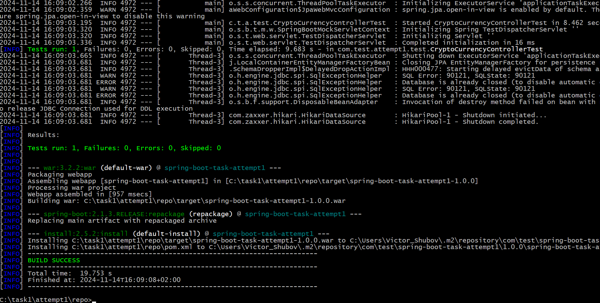
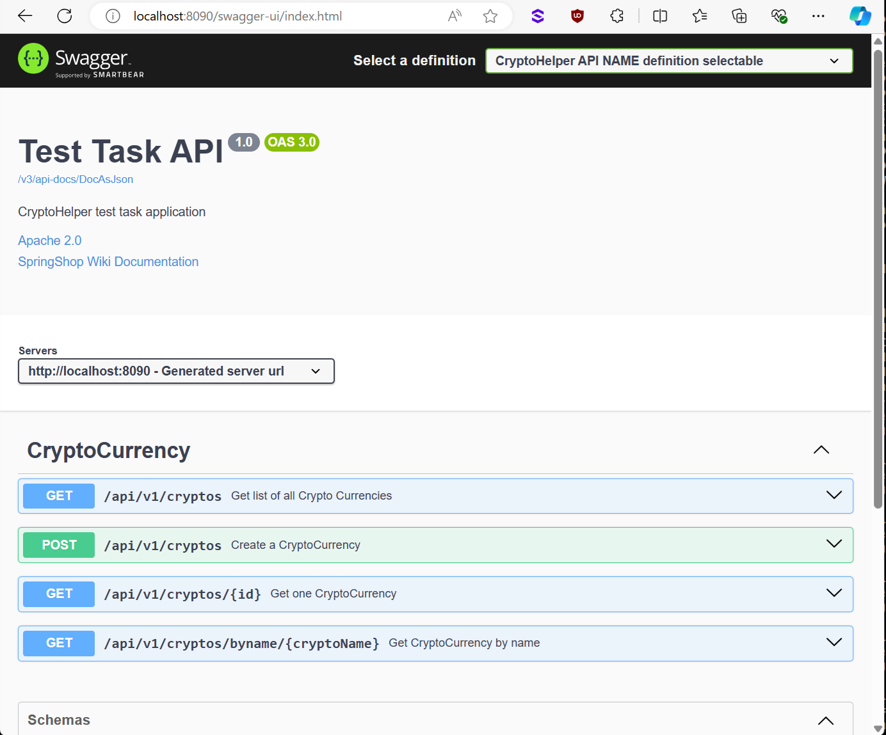

# Test Task Project

This is a small Spring Boot application. It shows a little bit processed
content of .csv files (of predefined structure).
**This is my first attempt to use Spring and Spring Boot - I was never involved in
related activity**, so I had to start from scratch.
I've spend some time (6-8hrs) reading online tutorials, and a few hours to
find a set of versions of Java, Maven, Spring Boot, SwaggerUI, mock tools for tests - compatible with each other.
**Having only 2 days for this project, my primary task was not to
provide optimal or best solution, but just to make the things work and learn basic
things about Spring Boot.**


## How to Run 

* Make sure you are using JDK 1.8 and Maven 3.*  (3.39 verified to be OK). JDK 1.8 is a bit outdated now,
but enough here: the task was to play with Spring, not with Java versions.

* Run ```mvn clean install``` to build the project and run tests (very basic, but it was time consuming task to
 run the first one: now, when main mocks are ready, it would be much easier to proceed).

You should see something like this:



Now all is ready to start the service:
```
mvn spring-boot:run -Drun.arguments="spring.profiles.active=test"
```

This way, the application would run with an embedded Tomcat.
Once the application runs you should see something like this

```
2017-08-29 17:31:23.091  INFO 19387 --- [           main] s.b.c.e.t.TomcatEmbeddedServletContainer : Tomcat started on port(s): 8090 (http)
2017-08-29 17:31:23.097  INFO 19387 --- [           main] Application        : Started Application in 22.285 seconds (JVM running for 23.032)
```

## About the Service

* APIs are "self-documented" by Swagger/OpenAPI using annotations
 
  API documentation is available at http://localhost:8090/swagger-ui/index.html

  Sample screenshot:
  


* The service uses an in-memory database (H2) to store the data. It's not necessary here right now (Data amount is not so huge),
but could be useful later. getCryptoCurrencyInfoByName endpoint do not use in-memory database having all the necessary data stored
in HashMap.
* There are tons of possible ways to read and parse a CSV, and wide field for optimization here, including multithreaded readers and so on.
Right now: just some reader which does it's job.
* Possible way to start query rate limiter implementation is shown - see CustomRateLimiterImpl::waitRateLimit(String remoteAddr).
The remote IP is not processed right now - it could be another task and completely out of 2 days scope.
* Errors and exceptions processing - it could be another task and completely out of 2 days scope. Some basic things provided.

# Implemented endpoints

1. POST to /api/v1/cryptos

Just for debug. Complete set of provided .csv's is now uploaded on application startup

2. GET to /api/v1/cryptos

returns the list of all the data uploaded

3. GET to /api/v1/cryptos/byname/{name}

returns min/max/oldest/newest price for given crypto name

4. GET to /api/v1/cryptos/{id}

Just for debug. Id is an internal autogenerated id - same as visible in complete data list.

